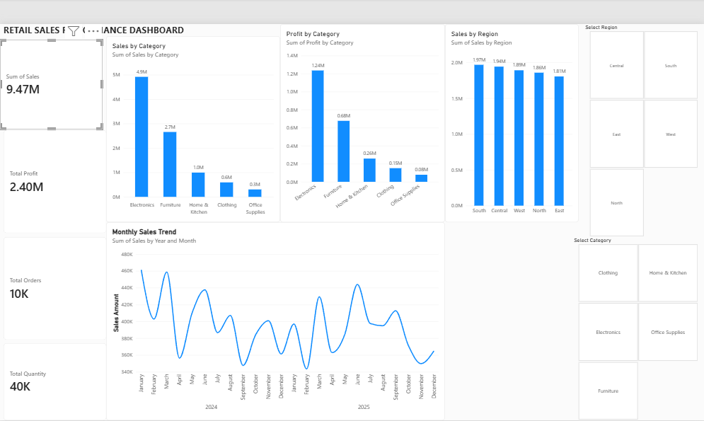

# 📊 Retail Sales Performance Dashboard

## 📌 Project Overview

This project is an interactive Retail Sales Performance Dashboard created using Microsoft Power BI.

The dashboard helps analyze sales, profit, orders, quantity, product categories, regions, and monthly sales trends.

## 📈 Key Performance Indicators

- 💰 Total Sales: 9.47M
- 📊 Total Profit: 2.40M
- 🛒 Total Orders: 10K
- 📦 Total Quantity: 40K

## 📊 Dashboard Features

- Sales by Category
- Profit by Category
- Sales by Region
- Monthly Sales Trend
- Region filtering
- Category filtering
- Interactive dashboard visuals
- Drill-down analysis

## 🛠️ Tools & Technologies

- Microsoft Power BI
- Power Query
- DAX
- Data Visualization

## 📷 Dashboard Preview

## 🎯 Project Objective

The objective of this project is to transform retail sales data into an interactive dashboard that provides useful insights into sales and business performance.

## 👨‍💻 Author

Kashish Mehra 
